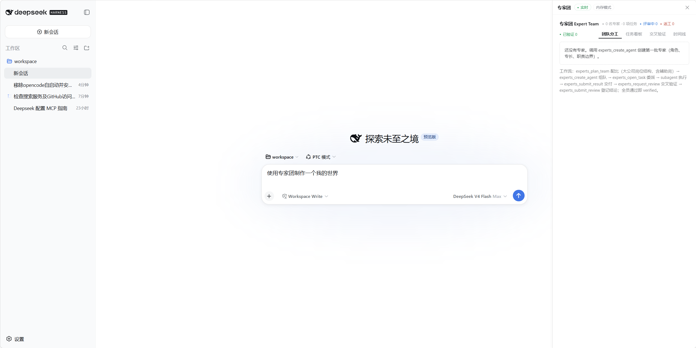
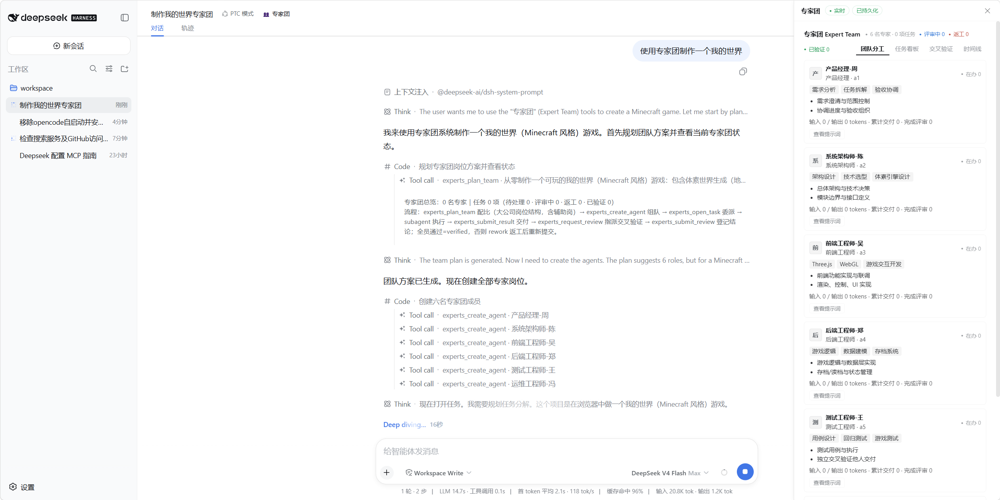
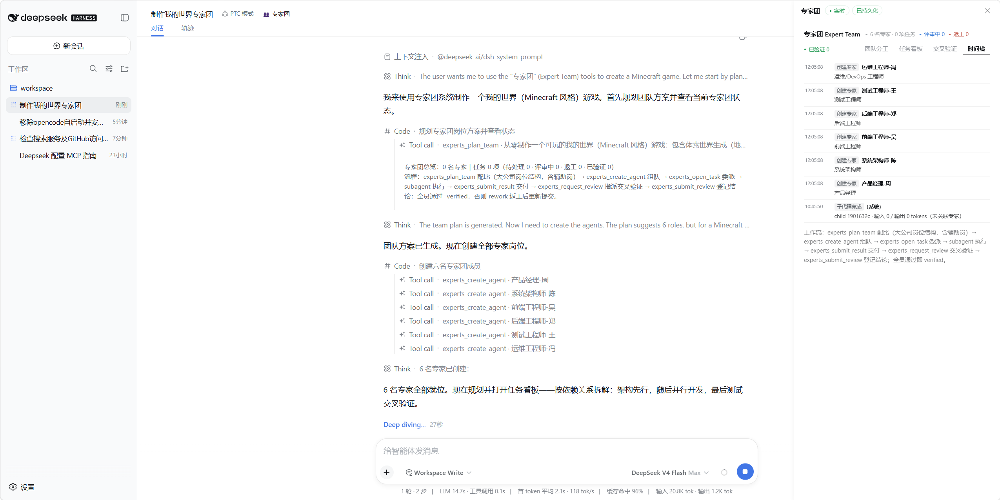
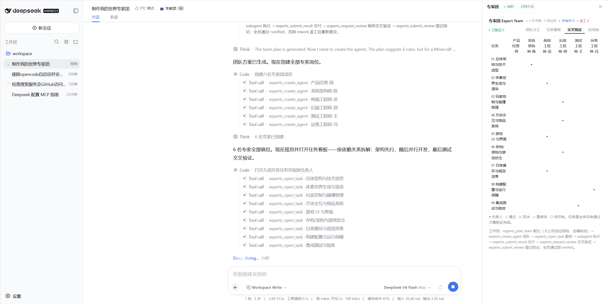
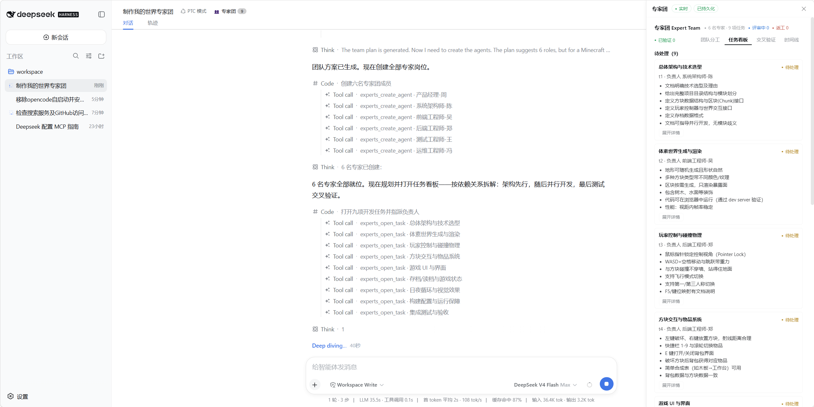

# dsh-expert-team

[English](README.md) | 中文

Expert Team（专家团）插件 for [DeepSeek Harness](https://github.com/deepseek-ai/deepseek-harness)：像 Qoder 专家团一样组织多个角色明确、职责独立的专家 agent，任务委派给负责人执行，其他专家**交叉验证**交付，全员通过方可结案。

- **8 个模型工具**：`experts_plan_team`（配比规划）/ `experts_create_agent`（组队）/ `experts_open_task`（委派）/ `experts_submit_result`（交付）/ `experts_request_review`（指派评审）/ `experts_submit_review`（登记结论）/ `experts_status`（总览）/ `experts_remove_agent`（移除）
- **两块 UI**：`experts_status` 调用卡片内的仪表盘（团队分工 / 任务看板 / 交叉验证矩阵）；会话标题栏「👥 专家团」按钮 + 实时浮动面板（SSE 推送，无需手动刷新）
- **二次迭代新增**：团队状态持久化到磁盘（`${DSH_HOME|~/.dsh}/storages/expert-team/team.json`，重启恢复）；任务 `dependsOn` 依赖阻塞（未满足依赖时拒绝提交成果）；面板新增连接状态指示（未连接 / 连接中 / 实时 / 重连中 / 轮询）、任务卡「展开详情」与持久化徽标（已持久化 / 内存模式）
- **组队原则**：参照大公司人员配比，岗位职责相互独立、避免重叠；设计类任务（软件 UI/视觉/交互/版式）内置**美术设计岗**；每组内置一名**辅助岗**（产品经理 / 协调员 / 文档专员）

## 界面展示

| 团队总览 | 团队分工 |
|---|---|
|  |  |

| 协作时间线 | 专家交叉验证 |
|---|---|
|  |  |

| 任务看板 |
|---|
|  |

## 安装与部署

插件按 DSH 官方 profile / bundle 范式安装（树外插件 + `link:` 依赖）。先用下列任一方式获取插件包，再按「通用部署步骤」操作。

### 方式一：从 GitHub 安装（推荐）

把仓库直接克隆到 profile 的 packages 目录：

```bash
cd %USERPROFILE%\.dsh\profiles\web
git clone https://github.com/tipus0731/dsh-expert-team.git packages/dsh-expert-team
```

### 方式二：本地复制（即插即用）

把本目录复制为
`%USERPROFILE%\.dsh\profiles\<profile名>\packages\dsh-expert-team\`
（`<profile名>` 通常为 `web`；也可放到任意位置后在部署步骤改用相对路径）。

### 方式三：npm 安装（即将发布）

包名 `dsh-expert-team` 已在 npm 预留，发布后即可：

```bash
cd %USERPROFILE%\.dsh\profiles\web
npm install dsh-expert-team        # 或：pnpm add dsh-expert-team
```

### 通用部署步骤

1. **修改 profile 的 package.json**（`%USERPROFILE%\.dsh\profiles\<profile名>\package.json`）：

   ```json
   {
     "dependencies": {
       "dsh-expert-team": "link:./packages/dsh-expert-team"
     },
     "dsh": {
       "profile": {
         "bundles": [
           "@deepseek-ai/dsh-base",
           "@deepseek-ai/dsh-web-app",
           "dsh-expert-team"
         ]
       }
     }
   }
   ```

   > 方式三（npm）时，把 `link:` 依赖改为 `"dsh-expert-team": "^1.1.0"`（或 `"latest"`）。

2. **安装依赖**（profile 目录下，需要 pnpm 10+）：

   ```bash
   corepack pnpm@10 install
   ```

3. **重启 DSH**。工具注册在宿主 tools 注册表**全局层**，所有预设、所有会话均可用。

## 使用

在任意会话直接说：

> 用专家团模式完成【任务】：先按大公司配比组队，任务交付后必须交叉验证。

agent 会依次调用 `experts_plan_team` 生成配比 → `experts_create_agent` 逐岗建专家 →
`experts_open_task` 委派（写清验收标准）→ subagent 执行 → `experts_submit_result` 交付 →
`experts_request_review` / `experts_submit_review` 交叉验证（负责人不得自审）→ 全员通过即
`verified`，否则退回 `rework` 附问题清单。

会话标题栏的「👥 专家团」按钮（进行中任务 > 0 时带角标）可随时打开实时面板查看团队与任务状态；
面板顶部显示**连接状态指示**（未连接 / 连接中 / 实时 / 重连中 / 轮询，其中「未连接」为无订阅方时的瞬态）与**持久化徽标**（已持久化 / 内存模式）；
每张任务卡可**展开详情**查看完整目标、交付摘要、返工问题清单与评审 findings。

## 工作原理 / 架构

```
dsh-expert-team/
├─ package.json        ← main=lib/index.js；exports "."/"./client"；dsh.bundle.patch + dsh.client
├─ cordis.patch.yml    ← bundle 层：insert 一行 { id: ui-expert-team, name: 'dsh-expert-team' }
└─ lib/
   ├─ index.js         ← Host 半：8 个 experts_* 工具（inject: ['tools','webServer']）
   │                      + 版本化快照 + 磁盘持久化 + 任务依赖阻塞；webServer 两条路由：
   │                      GET /api/expert-team/state（JSON）
   │                      GET /api/expert-team/events（SSE 推送）
   └─ client.js        ← Browser 半：三处插槽注册（tool.call.toolview /
                          conversation.session.header.actions / shell.overlay）
                          + 连接状态机 + 任务卡展开详情 + 持久化徽标
```

- 插件行同时是宿主行（root 导出注册全局工具）与客户端模块（`dsh.client` 声明进
  `window.__DSH_BOOT__`），一行两用；
- 依赖只声明 `peerDependencies`（`@deepseek-ai/dsh-tools`、`@deepseek-ai/cordis`），
  由宿主 DSH 提供，无重复实例；
- 面板数据经 `webServer` SSE 实时推送；浏览器端引用计数共享一条 EventSource，
  不可用时自动降级轮询；
- 团队状态（agents / tasks / 计数器 / 版本）每次变更异步写盘持久化，启动时加载
  恢复；写盘失败静默降级为内存模式，快照 `persisted` 字段标识当前持久化状态。

## 状态持久化

自 v1.1.0 起，专家团状态（专家 / 任务 / 计数器 / 版本号）在每次变更后异步写入磁盘存档，
DSH 重启后可自动恢复，无需手工备份或重建。

- **存储位置**：
  `${DSH_HOME 或 ~/.dsh}/storages/expert-team/team.json`
  （由 `resolveStorePath()` 推导，优先取环境变量 `DSH_HOME`，否则用户主目录下的
  `.dsh`；与 DSH 自身存储布局一致，无任何硬编码绝对路径）。
- **启动恢复**：`apply` 启动时读取该存档并校验每条记录的字段（缺必需字段或 JSON
  非法视作整体不合法），恢复成功则沿用存档中的状态；读档失败（不存在 / 损坏）则
  从空状态开始，不崩溃。
- **写入策略**：变更后异步写盘，采用串行化控制（`pending` 标志 + 最近一次内容
  **last-write-wins**），并发变更合并为最后一次内容，同一时刻最多一个写操作在途。
- **降级策略**：父目录缺失 / 权限不足 / 磁盘错误等导致写盘失败时**静默降级为内存模式**
  ——不抛错、不阻断任何工具调用；写盘成功即自动恢复持久化。快照携带 `persisted` 字段：
  `true` = 已成功加载存档或最近一次写盘成功（已持久化），`false` = 处于内存模式。
- **面板呈现**：浮动面板标题栏据此显示「已持久化」或「内存模式」徽标；`experts_status`
  快照接口与 SSE 推送同样携带该字段。

## 任务依赖

自 v1.1.0 起，`experts_open_task` 支持通过 `dependsOn`（可选，taskId 列表）声明任务
前置依赖，用于编排有先后关系的复杂任务。

- **阻塞判定**：某任务被阻塞当且仅当其任一依赖任务**未处于终态**。终态包括 `verified`
  与 `cancelled`；依赖任务缺失、仍为 `open` / `review` / `rework` 均视为未完成 → 阻塞。
- **派生字段 `blockedBy`**：每个任务的快照派生 `blockedBy` 字段（未满足依赖的 id 列表，
  无阻塞为空数组），不写入持久化结构，由 `blockedByFor()` 实时计算。「依赖阻塞：…
  未完成」显示于 `experts_status` 的文本输出；**任务卡仅展示声明的 `dependsOn` 依赖列表**
  （`blockedBy` 字段随快照下发，前端当前未消费）。
- **提交拦截**：`experts_submit_result` 提交成果时，若 `blockedBy` 非空则**拒绝提交**
  并返回被阻塞的依赖任务 id 列表；依赖全部满足（每个依赖均 verified / cancelled）后才
  允许登记成果、推进评审。
- **校验**：`experts_open_task` 会在创建时校验 `dependsOn` 各 id 对应任务是否存在，
  未知任务 id 直接报错，不会产生悬空依赖。

## 自定义

- **行 id 冲突**：若部署中已有 `ui-expert-team` 行 id，改 `cordis.patch.yml` 中的
  `id` 即可（`name` 必须是裸包名 `dsh-expert-team`，客户端扫描器依赖它）。
- **配比模板**：`lib/index.js` 顶部的 `ROSTER_TEMPLATES` / `GENERAL_ROSTER` 即
  `experts_plan_team` 的数据源，可直接增删岗位或调整职责边界。
- **预留路径**：`/api/expert-team/state` 与 `/api/expert-team/events` 由本插件
  占用，请勿与其他路由冲突。

## 卸载

1. 从 profile `package.json` 的 `dependencies` 与 `dsh.profile.bundles` 移除
   `dsh-expert-team`；
2. 删除 `packages\dsh-expert-team\` 与 `node_modules\dsh-expert-team`；
3. 重启 DSH。无残留状态。

## 兼容性

- 目标 DSH 版本族：`0.1.0-rc.6`（peer 依赖 `@deepseek-ai/dsh-tools ^0.1.0-rc.6`）。
  升级 DSH 后如工具或 `webServer` 服务契约变更，请同步修订本插件。
- 无任何绝对路径、机器特定配置或端口硬编码，纯相对路径，跨平台可移植。

## 开发历史

完整开发记录（安装调研、设计决策与验证记录）见 [docs/DEVELOPMENT.md](docs/DEVELOPMENT.md)。
